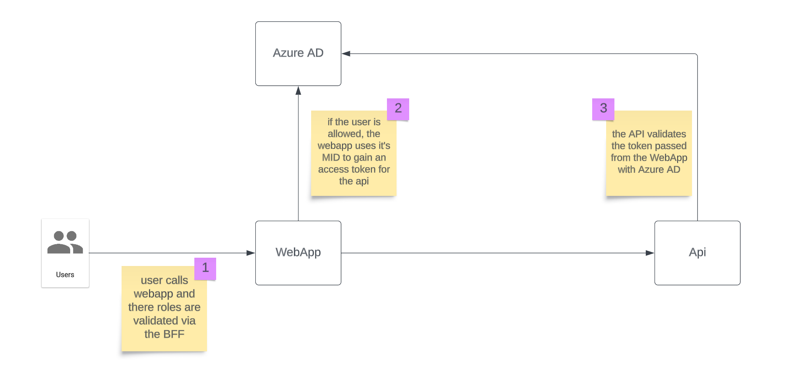

# Machine 2 Machine Authentication

This demo application shows how once service can call another service using it's [user assigned managed identity](https://learn.microsoft.com/en-us/azure/active-directory/managed-identities-azure-resources/overview) as a means of authorization.

This demo consists of two applications, one is a web app that a user can login to via azure AD, the other is an API that has no user login but authorizes all requests made to it. See the diagram below.



The typical flow of this application is listed below:

1. The user loads the root website
2. They are presented with an authenticate button
3. When they press the button then they are redirect to Microsoft to login
4. Once they have logged in they are redirect back to the web app where a cookie is placed in there browser, this identities the user to the web app. This also includes any role claims that were provided by Azure AD.
5. They are then placed on the `/Details` page.
6. This page makes a set of API calls to the downstream API depending on the users role. To authenticate this request it will use the scope of the API and it's managed identity to gain a short lived access token.
7. This token is then passed in the `Authorization` header of the HTTP request to the downstream API.
8. This API will check against it's authority (Azure AD) to check the token is valid.
9. It will also ensure the token has the correct role claims for the given endpoint.

## Structure

### Terraform

The terraform for this repository is split into two parts under the `deploy/terraform` folder. The `deploy/terraform/ad` folder contains all the necessary app registration declarations. 

> These don't cost any money so they won't need to be teared down and we also don't want the client ID changing all the time.

The `deploy/terraform/core` folder contains the resources required for the solution:
* app service plan
* application insights
* web app app service
* api app service
* role assignment for the web app to call the api

This can be deployed and tore down as you please. It does require the `ad` deployment to have been run first.

### Web App

The web application is a simple ASP.NET CORE razor pages application. It specifies to authentication handlers as defined below:

```csharp
builder.Services.AddAuthentication(
            options => { options.DefaultScheme = CookieAuthenticationDefaults.AuthenticationScheme; })
        .AddCookie(
            CookieAuthenticationDefaults.AuthenticationScheme,
            options => { options.AccessDeniedPath = "/Error"; })
        .AddOpenIdConnect(
            "AzureAd",
            "Azure AD Sign In",
            options =>
            {
                options.SignInScheme = CookieAuthenticationDefaults.AuthenticationScheme;

                options.Authority = "https://login.microsoftonline.com/16e04e4f-42c3-445b-9884-605e3bacbeee/v2.0";
                options.ClientId = "971dc533-5326-41bb-9719-8bd8f9cf61f4";

                options.CallbackPath = "/signin-azuread";
            });
```

The first is what will identify the user to this application, this uses cookies and is also the default scheme to authorize a user calling any web page.

It then defines an open ID connect handler. This is used for user authentication, it defines the authority as azure AD including the tenant ID (unique to your tenant) and also the client ID (The ID of the application in Azure AD). Notice it also defines the `SignInScheme` as the cookie handler. This means once the login has been completed it will pass the user `ClaimsPrincipal` over to the cookie handler to perform the sign in (write the cookie). This will include any roles returned by the login process. It is also worth noting the `CallbackPath` this has to match the `redirect_uris` defined in the terraform for this app registration as shown below:

```terraform
resource "azuread_application" "webapp" {
  display_name            = "Azure AD Auth Web App (${var.env_code})"
  group_membership_claims = ["ApplicationGroup"]

  web {
    implicit_grant {
      access_token_issuance_enabled = false
      id_token_issuance_enabled     = true
    }
    redirect_uris = [
      lower("https://localhost:5555/signin-oidc"),
      lower("https://localhost:5045/signin-azuread"),
      lower("https://app-${var.project}-webapp-${var.env_code}-${var.location_code}.azurewebsites.net/signin-azuread"),
      lower("https://app-${var.project}-webapp-${var.env_code}-${var.location_code}/signin-azuread"),
    ]
  }
  // The rest has been omitted for brevity
}
```

The sign in flow for a user is implemented by a button press on the `Index.cs.html` page. See below:

```c#
public async Task<IActionResult> OnPost()
{
    var result = await _authenticationService.AuthenticateAsync(
        HttpContext,
        CookieAuthenticationDefaults.AuthenticationScheme);

    if (result.Succeeded)
    {
        return RedirectToPage("/Details");
    }
    
    return Challenge(
        new AuthenticationProperties
        {
            RedirectUri = "/Details"
        },
        "AzureAd");
}
```

This first queries the users authentication state and if they are already logged in (have a valid cookie) then they are simply redirected to the `/Details` page.

If a user is not already authenticated then we are challenging the user's identity, to do this we are going to use the `AzureAd` authentication handler and we ask if successful to be redirect back to the `/Details` page. This will take the user to Microsoft to provider there login and then it will return back to the application.
